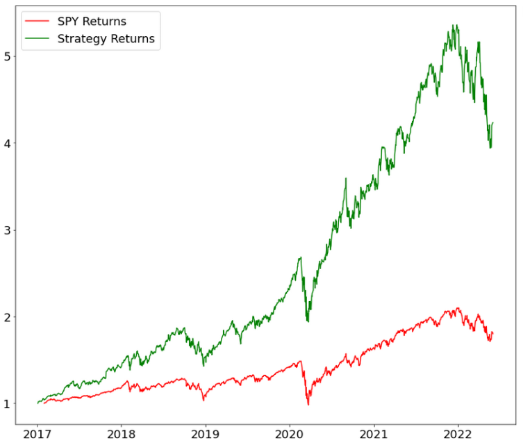

## Better Millennium - Retail Investor Solution

**Author:** Xibei(Julian) He
 
**Date:** July 7, 2022

## Overview

The goal to be achieved in this project is to build a comprehensive quantitative model to provide assistance to retail investor. This investment assistance tool provides prediciton on price action of stock, and also generate model portfolios depends on investor's risk and reward profile.

## Business Problem

According to Fortune, Today’s millennials have more economic power than any generation that preceded them. They are earning more, saving more, and investing earlier. 31% of millennials started investing before 21, compared to 9% of baby boomers and 14% of Gen X. For example, 67% of millennials own stock. They are likely to lead a new way of investing that transform the financial sector. However, investing or trading stock is never easy. According to multiple research studies, 80% of day traders quit within the first 2 years. And only 1% of day traders remain profitable. Trading stock is much harder than people think.

## Data Understanding

- Datasets: I am using daily returns of any stock from S&P500 for the past 10 years. 

- Limitation: I wish I could access to historical rating and ratings by different institutions to develop more functions. I will save that for future development. 

## Quantitative Modeling
### **EDA**
This chart shows the most concentrated Industries that followed by S&P 500, which is a stock market index that is tracking the best 500 public companies in the US. And here we got industrials, Technology, Financial services, Healthcare, Consumer Cyclical (AMZN, TSLA).

This is another example of how successful the Amazon has become for the past 20 years. Let’s say you invest $1 in Amazon in early 2000, you would have $100 right now. And volatility of the stock has gradually increased but very slow by historical standard and has come down entering 2020. And we all know what happened after. 

This is a prediction Amazon’s stock price after the model was trained on training and dev sets. 

See its comparison with the test set. There is still some lags but overall it catches the up and downs. 

 

This would be a weight assignment for the investor who does not want too much risk. 

The second chart is for the investor who can accept some volatility but also seek more return. 

Finally, the model would draw a strategy return based on constituent stocks. And this specific example has more than doubled the market return.

 

## Conclusions

- There are some limitations with the product. If I could access to key datasets such as historical rating, then I could incorporate a recommendation system, which is very important for this type of product.

- XGBoost is a great algorithm but it is sensitive to outliers and not perform well on unstructured data. 

- At the end of day, price prediction is very complicated. This product is just a simplified example of how quantitative analyst would approach to financial market. At least for now, no one can predict the market movement, but the key takeaway is how you would leverage these tools to make better decision.

 

## Further Development
- We would definitely need to include a recommendation system for Better Millennium. 

- LSTM (Long short-term memory) networks might be a better algorithm to take on prediction task. 

 

## Contact Info

Xibei (Julian) He: 

Email: julianhe1991@gmail.com

Linkedin: https://www.linkedin.com/in/xibeihe/

Github: [github](https://github.com/JulianHe1991)

